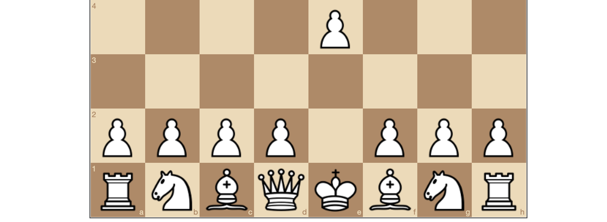

# *Best Chess*

# [Play Online](https://www.pippinbarr.com/best-chess/) (desktop and mobile)

## Description
*You have always dreamed of your computer solving chess! Or your phone! The ultimate act of computation! Make a move! Sit back! Relax! Only the best for you! Very thorough! Very thoughtful! Good things take time!*

_Best Chess_ was written in JavaScript using the excellent libraries [chess.js](https://github.com/jhlywa/chess.js/blob/master/README.md) and [chessboard.js](http://chessboardjs.com/), without which it would have been far too much work to bother with. The depth-first chess-solving algorithm is of my own (incredibly awkward and inefficient) creation. Please let me know if you happen to read it and notice a problem.

## Documentation
* Read the [Process Documentation](../process)
* Look at the [Code Repository](https://github.com/pippinbarr/best-chess) for source code etc.

## Press
* [Kill Screen](http://killscreendaily.com/articles/best-chess-uses-all-computational-power-just-mess-your-mind/)
* [Matajuegos](http://mata.juegos/en/2016/07/minimal-input-games-and-the-exploration-of-juice/).

## License
*Best Chess* is licensed under a [Creative Commons Attribution-NonCommercial 3.0 Unported License](http://creativecommons.org/licenses/by-nc/3.0/).
