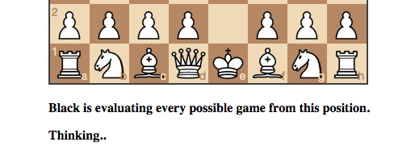

# Blog Posts

Here are public-facing blog posts I wrote about the game.

## Trying (and Failing) Perfectly (at Chess) (2015-07-28)

When I've talked and thought about _[Let's Play: Ancient Greek Punishment](http://www.pippinbarr.com/games/letsplayancientgreekpunishment/LetsPlayAncientGreekPunishment.html)_ in the past, one of the elements I've always enjoyed and dwelled on is its relationship to time and computation. Specifically, I like the way the code itself of those small games enacts the punishments &#8216;accurately', in that they last forever. Your computer, in playing them, is willing to let you try to push Sisyphus' boulder up the hill indefinitely.

Over the last few days I've been making something related, but with chess. Specifically, I'm making a game, _Best Chess_, which is just, well, a game of chess, except that your opponent plays perfectly. Or would.

It goes like this: you are presented with a standard chessboard and invited to make your first move. You make your move (whatever it is, but say &#8216;1. e4'). Then the computer opponent (playing as black) proceeds to solve chess from that position by exhaustive search. That is, it examines every possible outcome of every possible game ensuing from your first move. Once it has done that it will either make a move of its own (because it has established that with perfect play it will win no matter what), offer you a draw (because it has established that with perfect play there will be a draw), or resign (because it has established that with perfect play _you_ will win no matter what). That's it.

But of course that's not it. For one thing, black will never move its piece, because solving chess in this way takes quite a while. There are quite a few games to examine from the starting position – people say it's about 10^120 (also known as the [Shannon Number](https://en.wikipedia.org/wiki/Shannon_number)). That's so many that it outnumbers the atoms in the atoms in the observable universe, for example. So your if you play _Best Chess_ on your iPhone, say, it's not realistically going to be able to calculate all those games and then respond. Nobody is.

But the magical tension in there, for me, is that your iPhone will still be _doing it_ nonetheless &#8211; your iPhone would be engaged in solving chess in all earnestness. So you would then be holding a computer in your hand that is solving chess. That's interesting and strange. It seems simultaneously hopeless (and a bit sweet somehow) and extraordinarily powerful. It both is and is not performing a momentous act of computation.

I like that.

## Best Chess and "Thinking..." ("Forever") (2015-07-29)

Another thing that's been interesting about making _Best Chess_ has been trying to get the &#8216;right' user-interface in terms of information. The actual interactive side is fine, of course – it's just a chess-board and the player can presumably intuit that they draw a piece to a position to play their move. Fortunately the excellent libraries [chess.js](https://github.com/jhlywa/chess.js/blob/master/README.md) and [chessboard.js](http://chessboardjs.com/) take care of literally all of this, which is pretty amazing. No way I would have made this game without them.

As you of course know, _Best Ches__s_ involves the human player making the first move (as white), and then the computer player solving chess from that position (as black). That is, black examines every possible move and game from the position and evaluates every outcome to determine whether, through perfect play, the game results in a draw, a win, or a loss. The point of the game is (I suppose?) to allow the player to think about the enormity of this as a task, the plucky character of their computer (or phone!) for even trying, the tragedy of its doomed effort, and so on. It's very emotional.

But how do you convey that the game is "really solving chess"? Well, for one thing you could just have the player do the old &#8216;View Source' on the page to see the JavaScript that _does_ do this, but that's not really going to be a big crowd-pleaser and many people won't be able to interpret the code. And anyway, the point is really, again, to convey the aesthetics of a computer solving chess rather than to prove it's happening.

The &#8216;solution' I found isn't especially interesting, though – it's just interesting to me that this _did_ require thought at all, that you need to think about how to convey a particular tone, even with something as dry as a depth-first tree search of chess! In the end I combined three different signals:

_Just say it outright_. For one thing, the game just literally tells the player &#8216;Black is evaluating every possible game from this position.' Pretty basic stuff, but usefully gets the point across. I did have language focusing more on the word &#8216;solving', but in the end that was a little more abstract and less effective, I thought.

_"Thinking..."_ In chess games you often can tell that the AI opponent is &#8216;thinking' because it just tells you or cycles some basic animation. In tribute to that, _Best Chess_ does a classic &#8216;animated elipsis' to indicate thought. This also helps to set up and contextualise the third part...

_Show some inner workings_. As a way of compromising between showing the actual code and showing nothing, the game displays the current moves in the current game its evaluating. Just the first move (to contextualise and link the evaluation to the actual board position visible) and then the latest four moves, which cycle (fairly) rapidly as the depth-first search proceeds and give some sense of actual calculation and activity. (I tried a bunch of ways of representing moves from the game and this one feels the best.)

As a final note, when I've put the question of how to represent that the game is &#8216;thinking' to other people, they've generally quite reasonably suggested various visualisation techniques, from heat-mapping to animated ghost pieces appearing on the board as evaluation proceeds. The reason I didn't want to do this in the end is that I think there's something important about the starkness of the board the way it is, with a single move played, waiting (forever, effectively) for the next. It has rhetorical power or something.

There, more words about a chess game. Who'd have thunk it?

## Three Best Chess Short Stories (2015-07-31)

To round out discussing _[Best Chess](www.pippinbarr.com/games/bestchess/)_, here are a couple of other stray thoughts I've thought while making it and playing it over the last week or so.

_View source_. I wonder how many people who play _Best Chess_ will ever check up on it by doing a &#8216;view source' on the webpage. The entire source of the game is just sitting there, unobfuscated in the index.html file, so you can literally see what the page is running (and even understand it if you know some JavaScript or a related language). This reminds me of _[Leaderboarder](http://leaderboarder.meteor.com/)_ in some ways, and the idea of players intervening or at least engaging with the underlying code of the game they're playing, whether it's to better understand the game or to potentially mess with it. Will this become more of a thing as more and more games are written in JavaScript etc.? Will there be more obfuscation?

_Does it work?_ An importantly weird element of writing a chess-solving AI like this is that you can't actually test it. Given that it's objective is to solve chess, and given that's impossible (time-wise), you'll never really know whether it works or not. That was a constant strange feeling that led me to repeatedly &#8216;prove' to myself that the approach I was taking (to implement the depth-first search) was legitimate and _would_ solve chess, given enough time. (Since release various people keep querying whether it works, whether it would run out of space, etc., constantly shaking me to my core.)

_I solved chess!_ One embarrassing story from development was when I managed to think (for about 2 or 3 minutes) that the game might solve chess randomly after running for only a short time because it would just stumble into the solution. Rilla and I then postulated an issue of Science with me on the cover and the headline &#8216;Idiot Solves Chess' (me being the idiot). But then of course I recalled that this algorithm (or any) can't actually solve chess during a partial run like that &#8211; the whole point is you have to examined _all_ the options, which takes almost forever. (The follow-up Science cover was going to be &#8216;Idiot is Just an Idiot After All'.)

That's it. I'm moving on to my next thing, called... _BREAKSOUT_!
